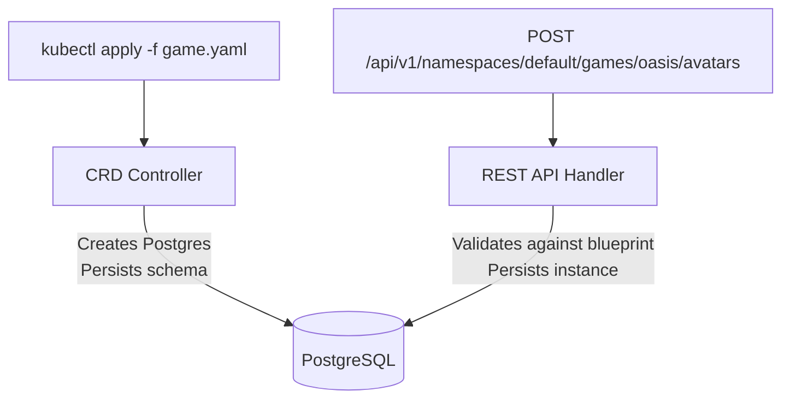

# KubeGame

A Kubernetes operator for building gamification platforms. KubeGame lets you define game mechanics as Custom Resources and manages the runtime through a REST API.

## Architecture

KubeGame uses a two-layer design:

- **CRD Layer** (Schema/Config): Game designers define blueprints via `kubectl apply`. Controllers provision infrastructure and persist schema definitions to PostgreSQL.
- **REST API Layer** (Runtime Data): Game clients create and manage player data through HTTP endpoints with validation against the blueprints.



## Custom Resources

| CRD | Purpose |
|-----|---------|
| **Game** | Top-level resource. Provisions a PostgreSQL deployment per game. |
| **World** | Defines worlds/planets within a game. |
| **Avatar** | Blueprint for avatar types. Defines attribute types, inventory types, and achievement types. |
| **Area** | Sub-regions within worlds. Defines connected areas and properties (pvp, level, type). |
| **ItemCatalog** | Item blueprints: Equipment, Vanity, Elite items, and Power-ups with effects. |

### Avatar as a Blueprint

The Avatar CRD is a generic scaffold, not a concrete avatar. It defines **what types of attributes, inventory, achievements, and customizations** an avatar can have. Actual avatar instances are created via the REST API and stored in the database.

```yaml
apiVersion: kubegame.systemcraftsman.com/v1alpha1
kind: Avatar
metadata:
  name: oasis-avatar
spec:
  game: oasis
  type: "Adventurer"
  attributeTypes:
    - name: "strength"
      valueType: "int"
    - name: "intelligence"
      valueType: "int"
  inventoryTypes:
    - name: "Weapon"
      category: "Equipment"
    - name: "Vehicle"
      category: "Transport"
  achievementTypes:
    - name: "Copper Key"
      description: "Found the first key."
  customizationTypes:
    - name: "Race"
      options: ["Human", "Elf", "Orc", "Dwarf"]
    - name: "Class"
      options: ["Warrior", "Mage", "Rogue", "Cleric"]
```

### Database Credentials

Database credentials are managed via Kubernetes Secrets:

```yaml
apiVersion: v1
kind: Secret
metadata:
  name: oasis-db-credentials
type: Opaque
stringData:
  username: oasisUser
  password: SomeSecretPassword
```

Reference the Secret in the Game CR:

```yaml
spec:
  database:
    secretRef: oasis-db-credentials
```

## REST API

The API server runs on port `8082` alongside the operator.

| Method | Endpoint | Description |
|--------|----------|-------------|
| `GET` | `/api/v1/namespaces/{ns}/games/{game}/worlds` | List all worlds |
| `GET` | `/api/v1/namespaces/{ns}/games/{game}/worlds/{name}` | Get a specific world |
| `GET` | `/api/v1/namespaces/{ns}/games/{game}/worlds/{world}/areas` | List areas in a world |
| `GET` | `/api/v1/namespaces/{ns}/games/{game}/worlds/{world}/areas/{name}` | Get a specific area |
| `GET` | `/api/v1/namespaces/{ns}/games/{game}/items` | List item catalog |
| `GET` | `/api/v1/namespaces/{ns}/games/{game}/items/{name}` | Get item details |
| `POST` | `/api/v1/namespaces/{ns}/games/{game}/avatars` | Create an avatar instance |
| `GET` | `/api/v1/namespaces/{ns}/games/{game}/avatars` | List all avatar instances |
| `GET` | `/api/v1/namespaces/{ns}/games/{game}/avatars/{name}` | Get a specific instance |
| `DELETE` | `/api/v1/namespaces/{ns}/games/{game}/avatars/{name}` | Delete an instance |
| `POST` | `/api/v1/namespaces/{ns}/games/{game}/avatars/{name}/inventory` | Grant item to avatar |
| `POST` | `/api/v1/namespaces/{ns}/games/{game}/avatars/{name}/equip` | Equip an item |
| `POST` | `/api/v1/namespaces/{ns}/games/{game}/avatars/{name}/unequip` | Unequip an item |
| `POST` | `/api/v1/namespaces/{ns}/games/{game}/avatars/{name}/powerups/activate` | Activate a powerup |
| `GET` | `/api/v1/namespaces/{ns}/games/{game}/avatars/{name}/powerups` | List active powerups |

Shorthand paths without `/namespaces/{ns}` default to the `default` namespace.

Instance creation validates against the avatar blueprint: attributes, inventory categories, achievements, and customizations must be defined in the corresponding Avatar CRD.

## Quick Start

### Prerequisites

- Go 1.26+
- A Kubernetes cluster (Kind, Minikube, etc.)
- kubectl
- operator-sdk v1.42.3

### Deploy

```bash
# Install CRDs
make install

# Run the operator locally
make run
```

### Create a Game

```bash
kubectl apply -f examples/oasis/oasis.yaml
kubectl apply -f examples/oasis/oasis-avatar.yaml
kubectl apply -f examples/oasis/incipio.yaml
kubectl apply -f examples/oasis/archaide.yaml
kubectl apply -f examples/oasis/chthonia.yaml
kubectl apply -f examples/oasis/middle-earth.yaml
kubectl apply -f examples/oasis/oasis-areas.yaml
kubectl apply -f examples/oasis/oasis-items.yaml
```

### Seed Avatar Instances

```bash
./examples/oasis/seed-oasis-avatars.sh
```

This loads 8 Ready Player One characters (Parzival, Art3mis, Aech, Daito, Shoto, Anorak, i-r0k, IOI-655321) via the API.

### Verify

```bash
curl -s http://localhost:8082/api/v1/namespaces/default/games/oasis/avatars | python3 -m json.tool
```

## Gamification Mechanics Roadmap

KubeGame aims to implement all [35 Gamification Mechanics](https://www.epicwinblog.net/2013/10/the-35-gamification-mechanics-toolkit.html) by @victormanriquey:

- [x] World
- [x] Avatar (blueprint + instance API)
- [x] Area
- [x] Customization
- [x] Equipment, Vanity/Elite Items, Power-ups (ItemCatalog CRD)
- [ ] Currency, Trading
- [ ] Skills/Traits, XP Points (SkillTree CRD)
- [ ] Quest, Tutorial, Special Challenge
- [ ] Levels, Time Events
- [ ] Achievements (grant/revoke API), Leaderboards, Rankings
- [ ] Rewards (fixed/variable/random), Loot Tables, Easter Eggs
- [ ] Guilds, Parties/Teams, Social Graph, Chat
- [ ] PvP, Punishments, Lifejackets, Ambassadors
- [ ] Progress HUDs (dashboard API)

## Contributing

If you are familiar with gamification, Go, and Kubernetes operators, please check out the [issues](https://github.com/SystemCraftsman/KubeGame/issues) to contribute.
